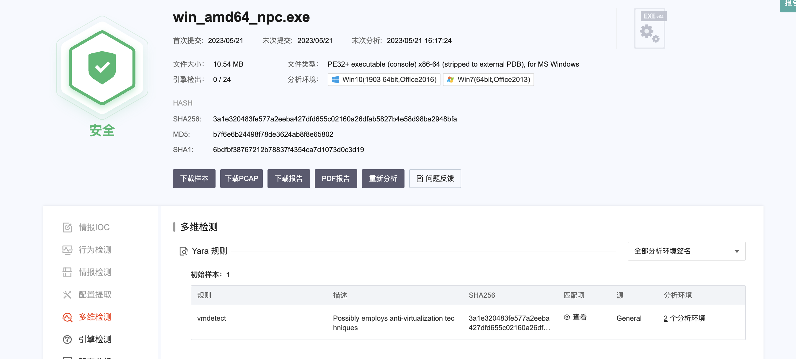
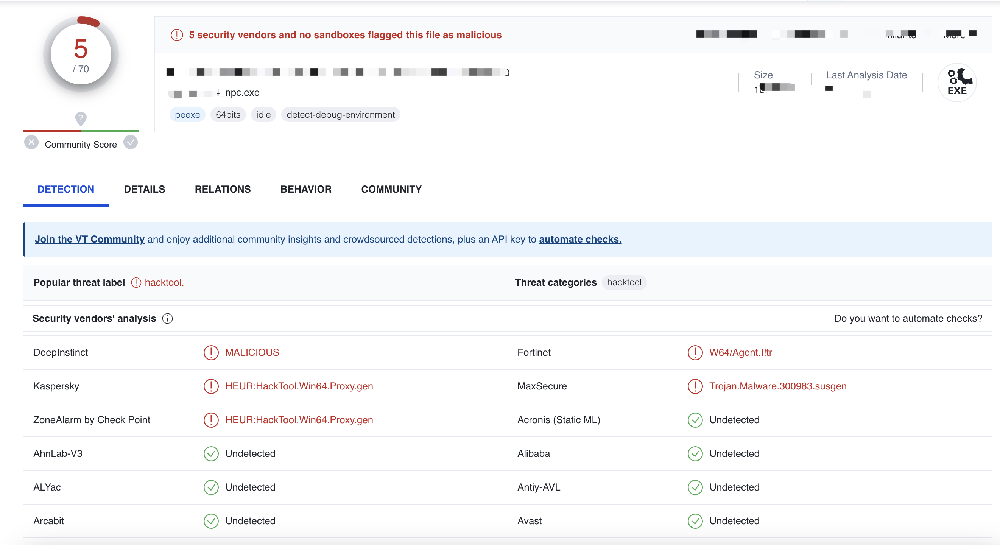
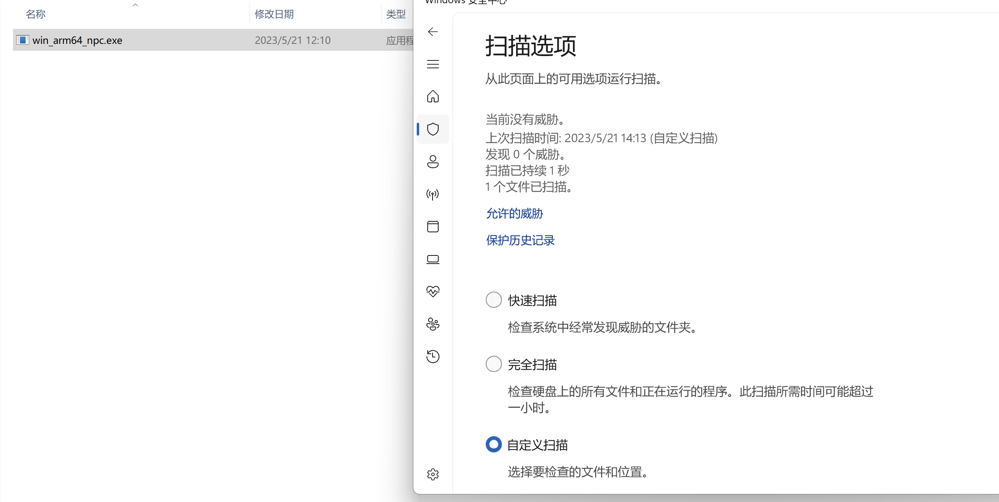
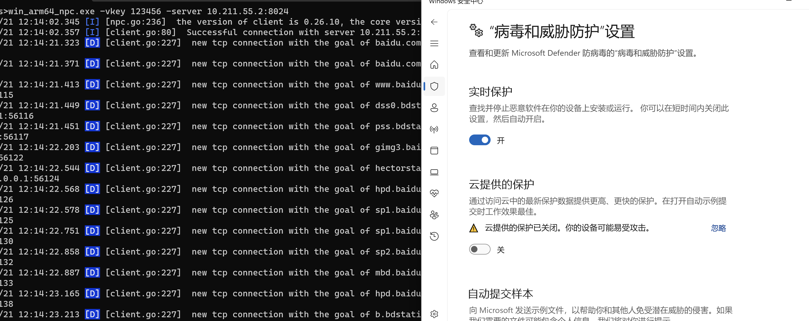
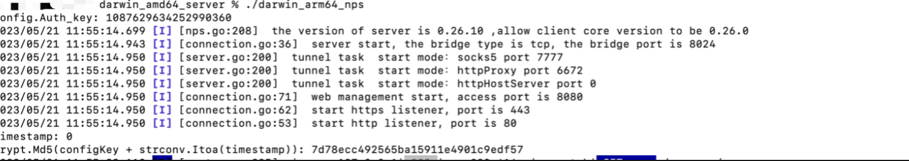
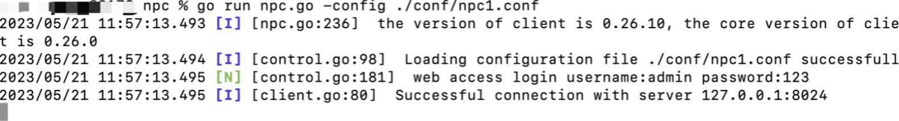
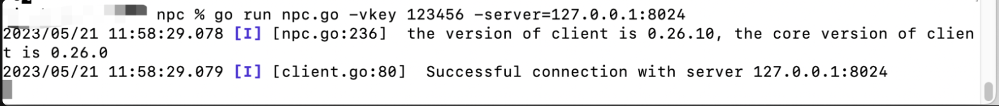

# 免责声明🧐
本工具仅面向 **合法授权** 的企业安全建设行为，如您需要测试本工具的可用性，请自行搭建靶机环境。

在使用本工具进行检测时，您应确保该行为符合当地的法律法规，并且已经取得了足够的授权。**请勿对非授权目标进行扫描**。

如您在使用本工具的过程中存在任何非法行为，您需自行承担相应后果，我们将不承担任何法律及连带责任。

在安装并使用本工具前，**请您务必审慎阅读**、充分理解各条款内容，限制、免责条款或者其他涉及您重大权益的条款可能会以加粗、加下划线等形式提示您重点注意。 除非您已充分阅读、完全理解并接受本协议所有条款，否则，请您不要安装并使用本工具。您的使用行为或者您以其他任何明示或者默示方式表示接受本协议的，即视为您已阅读并同意本协议的约束。

# 工具来源及其说明
```
（1）nps通信流量比较稳定，但特征抓的比较死，所以基于原版的nps进行二次开发
```
### 说明
为了工具的免杀性及其后期修改，本人不公开源码。 **本人承诺，工具无毒，只能简单进行二开**

# 魔改部分

```
（1）重写了nps的认证过程，通信过程均进行加密
（2）重些了npc的部分，预计后续分离config文件进行加载
（3）进行了nps未授权漏洞的修复，避免了默认配置未授权
```


# 免杀情况
（这是魔改后的demo上去的，还请各位测试切莫进行☁️测试、沙箱测试、联网测试）
### 魔改后流量
魔改后的工具流量就不进行抓取了，需要的话，大家可以自行进行测试。


### 某社区☁️沙箱（demo版测试）


### virustotal


### windows defender（静态）


### windows defender（动态）



### 360、火绒等其他杀软未进行测试


# 项目使用
未进行测试nps服务端的注册，所以目前主要还是 ./nps的方式来运行
## 服务端使用



## 客户端使用

### 配置文件启动
配置文件如下：
```
[common]
server_addr=127.0.0.1:8024
conn_type=tcp
vkey=123456
auto_reconnection=true
max_conn=1000
flow_limit=1000
rate_limit=1000
web_username=admin
web_password=123
crypt=true
compress=true
#pprof_addr=0.0.0.0:9999
disconnect_timeout=60

```



### 命令行启动



# 项目进度

✅ 2023.5.19 重新写了通信认证协议

✅ 2023.5.20 把连接流量进行混淆，仅仅支持客户端命令行启动，未支持conf文件启动

✅ 2023.5.21 支持本地config文件加载

# 后续增加
   （1）~~增加config文件分离，实现远端拉取~~（估计很快）
   
   （2）~~实现其他流量的魔改~~
# 参考
```
https://github.com/ehang-io/nps
```

